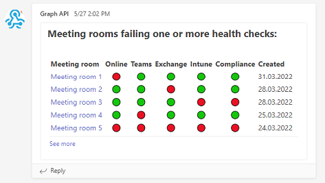

MTR-TeamsWebhook
=========
Send a health status to a Teams channel using data retrieved from Microsoft Graph API

This is a complete solution which will create a resource group with everything needed for the function app to run it's code securely based on a schedule (using NCRONTAB expressions)

| Filename                     | Comment                                               |
| ---------------------------- | ----------------------------------------------------- |
| deploy.ps1                   | is used to deploy the solution (see Quickstart below) |
| bicep\main.bicep             | takes care of creating all the required resources     |
| funcApp\health\run.ps1       | is the actual script that will run                    |
| funcApp\health\function.json | is the schedule                                       |

If you don't want any alerts if the function fails, then just comment out the entire "newAlerts" module in `bicep\main.bicep`

If your language is not Norwegian you probably want to change some things `funcApp\health\run.ps1` :D

# Example screenshot

# TODO
- Code cleanup. A lot of test-fail-tryagain which undoubtedky resulted in some spaghetti-code...
- Maybe change the `secrets.json` requirement into parameters (but that becomes annoying when re-deploying multiple times)?
- Make the Intune checks optional

# Quickstart

1. [Create a Webhook connector](https://docs.microsoft.com/en-us/microsoftteams/platform/webhooks-and-connectors/how-to/add-incoming-webhook) in the teams channel you want to notify.
2. [Create an app registration in azure](https://docs.microsoft.com/en-us/azure/active-directory/develop/quickstart-register-app) with a "credential" (secret)
3. TODO: Give app correct permissions(????) 
4. Create a `secrets.json` file in the root folder (same folder as deploy.ps1) using some information from the above two steps:
```json
{
    "$schema": "https://schema.management.azure.com/schemas/2019-04-01/deploymentParameters.json#",
    "contentVersion": "1.0.0.0",
    "parameters": {
        "funcAppTenantId": {
            "value": "AZURE TENANT ID"
        },
        "funcAppAppId": {
            "value": "AZURE APP REGISTRATION - Application ID"
        },
        "funcAppClientSecret": {
            "value": "AZURE APP REGISTRATION - Application Client Secret Value"
        },
        "funcAppTeamsHook": {
            "value": "Teams Webhook Value"
        }
    }
}
```
5. Install the [Az Powershell module](https://docs.microsoft.com/en-us/powershell/azure/install-az-ps), version 7 minimum (probably?)
6. Run `Connect-AzAccount` and authenticate with an account that has enough access
7. Run `.\deploy.ps1 -subscription <your azure subscription ID here>`

Done!

Or wait...

Instead of waiting for the schedule to trigger, you probably want to test it, right?
TODO: Instructions for testing it inside Azure portal

# Inquiries
Questions related to this code or project can be created as issues here on GitHub